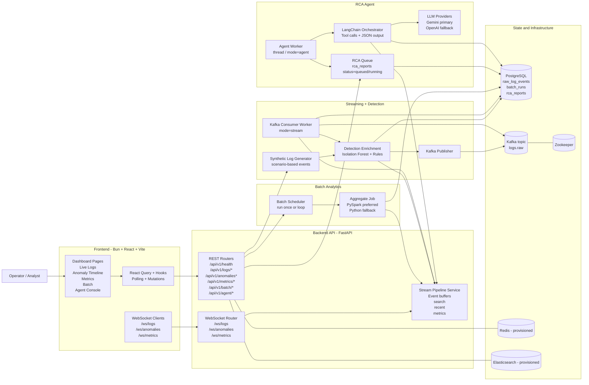
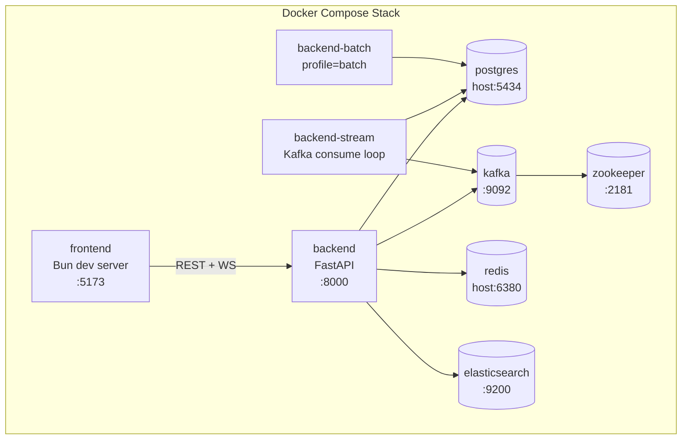
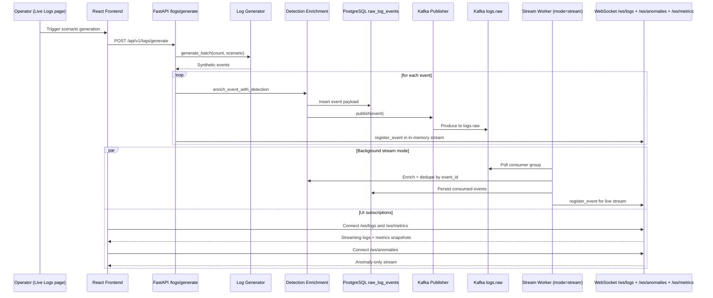
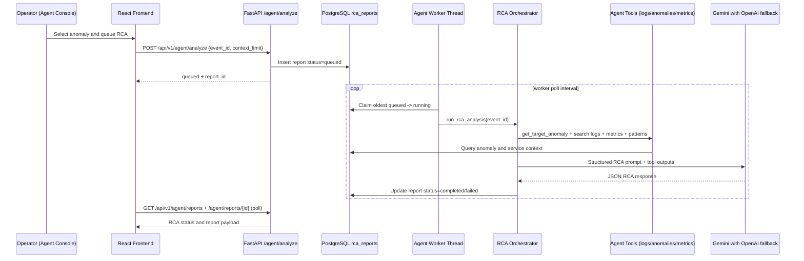
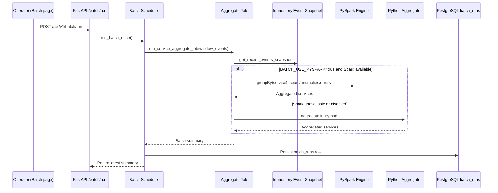
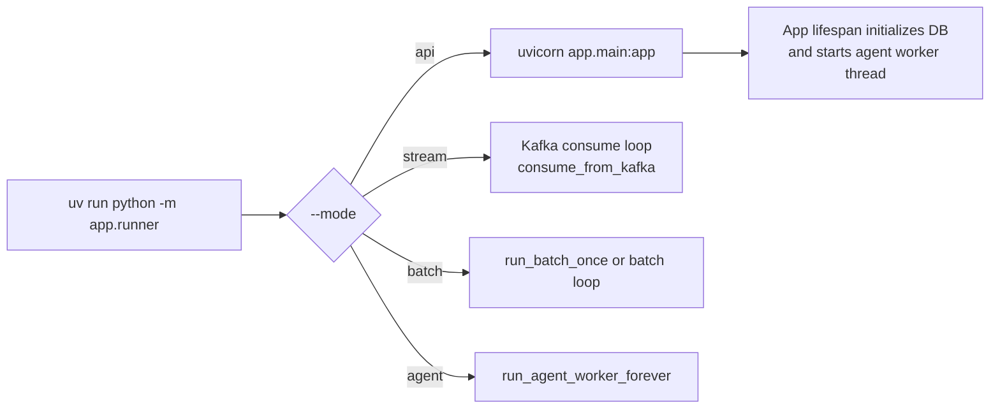

# LogPulse RTBDA Architecture Diagram

This document maps the current LogPulse implementation as a real-time big data analytics (RTBDA) system.

## 1) Overall Architecture



## 2) Docker Compose Runtime Topology



## 3) Real-Time Stream Path (How Logs Flow)



## 4) RCA Agent Workflow



## 5) Batch Analytics Workflow



## 6) Backend Process Modes



## 7) API and WebSocket Surface

```mermaid
flowchart TB
    subgraph REST[/api/v1]
        H[/health]
        LOGS[/logs/scenarios\n/logs/generate\n/logs/recent\n/logs/search]
        ANOM[/anomalies\n/anomalies/recent\n/anomalies/{event_id}]
        MET[/metrics/live\n/metrics/batch]
        STREAM[/stream/status\n/stream/consume]
        BATCH[/batch/status\n/batch/run]
        AG[/agent/config\n/agent/analyze\n/agent/reports\n/agent/reports/{report_id}]
    end

    subgraph WS[WebSockets]
        WSL[/ws/logs]
        WSA[/ws/anomalies]
        WSM[/ws/metrics]
    end
```

## 8) Key Notes for RTBDA Behavior

- Real-time path is hybrid:
  - Direct generation path writes to DB and in-memory stream immediately.
  - Kafka path enables decoupled stream consumption in `backend-stream` mode.
- Frontend uses both WebSocket streaming and periodic REST polling for resilience.
- Anomaly scoring combines model score (Isolation Forest) and deterministic rules.
- RCA is asynchronous with queue semantics (`queued -> running -> completed/failed`).
- Batch analytics currently aggregates service metrics from recent in-memory events and persists run summaries.
